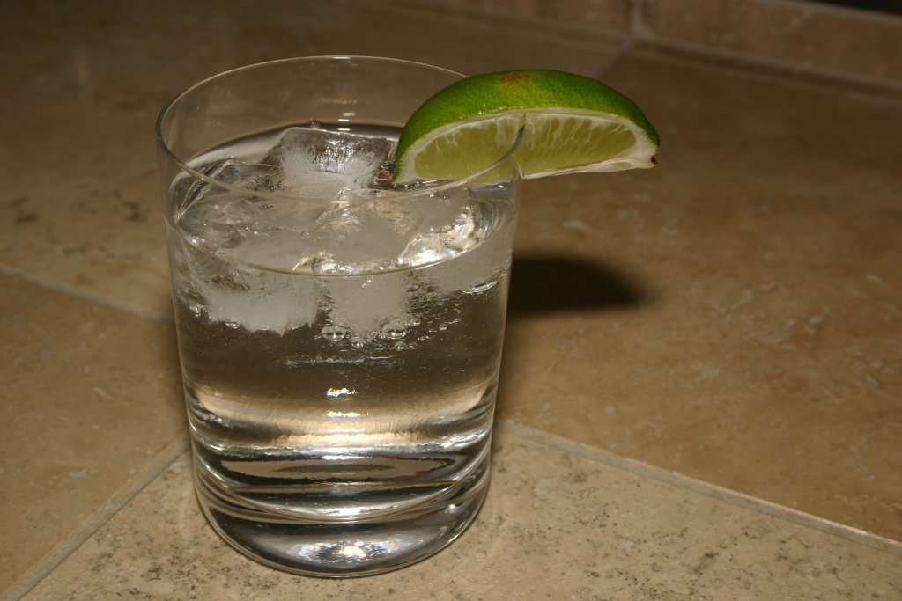

<!DOCTYPE html>
<html lang="en">

<head>
<meta charset="utf-8"/>
<title>PGT | Gin & Tonic</title>
<link rel="stylesheet" href="stylesheet.css">
</head>

<body>
<header>
	<h1>PGT</h1>
	<nav>
		<a href="homepage.html">Home</a> |
		<a href="drinkpage.html">Gin & Tonic</a> |
		<a href="biopage.html">Bio</a> |
		<a href="updatespage.html">Updates</a>
	</nav> 
</header>
<h2>What is a gin and tonic?</h2>

Classic and simple, the <a href="https://en.wikipedia.org/wiki/Gin_and_tonic">gin and tonic</a> is my cocktail of choice, no matter the weather. It's an easy-to-make mixed drink that requires only the two named ingredients and a few slices of lime, all of which naturally compliment eachother.

</body>

</html> 